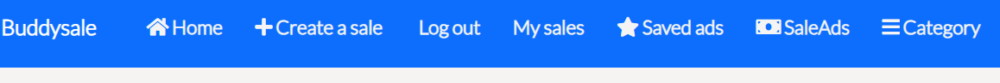
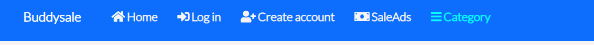
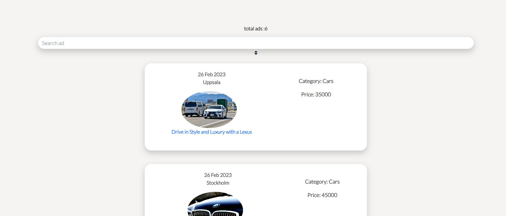
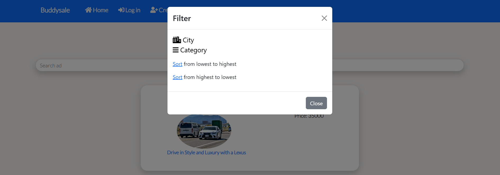
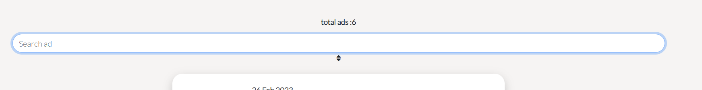
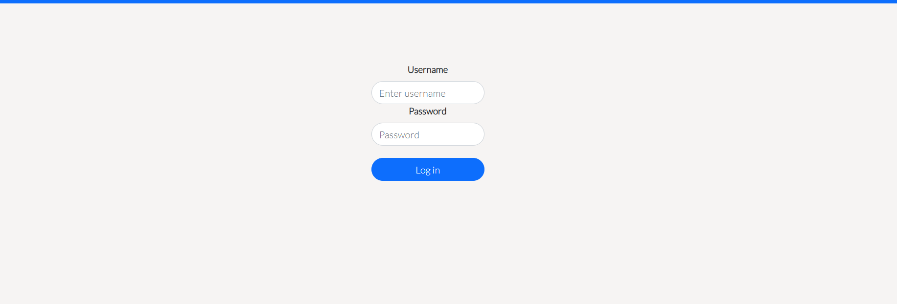
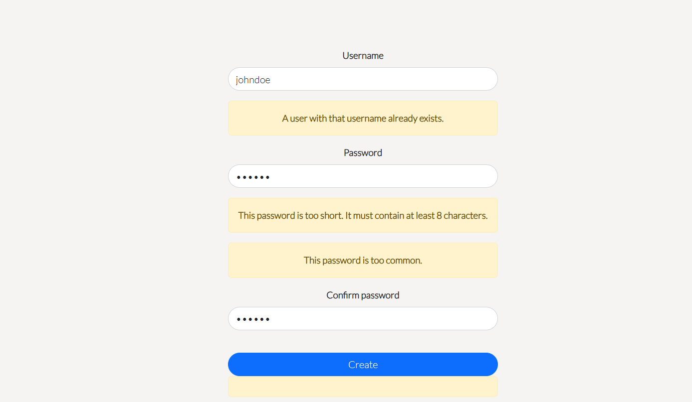

# Buddysale

Why Buddy Sale?
In today's digital world, buying and selling items should be easy, social, and engaging. Traditional marketplaces feel transactional and impersonal, while social media platforms lack proper tools for secure and efficient selling. Buddy Sale was created to bridge this gap—a platform where people can sell their items in a way that feels as interactive and community-driven as social media.

With Buddy Sale, users can list items, engage with potential buyers, and build trust through a familiar and user-friendly interface. Whether you're selling gadgets, clothes, or furniture, Buddy Sale makes the process seamless, fun, and safe.

# Website link

* [BuddySale](https://buddysale.herokuapp.com/)

# Project goals
The project goals for this project is the following.

* Learn how to connect your frontend project to the backend.

* Learn how to reuse components throughout the page.

* CRUD functionality with React.

* Write clean code.

* Debugging with React.

* Use of network request with the async function.

# User Stories for Buddy Sale
1. User Registration & Account Management
As a new user, I want to create an account so that I can start buying and selling items.
As a registered user, I want to edit my profile information so that I can update my details and preferences.
As a user, I want to delete my account so that I can remove my data from the platform if I choose to leave.

2. Listing & Selling Items
As a seller, I want to upload multiple images for my listing so that buyers can see my product from different angles.
As a seller, I want to edit my listing so that I can update details like price, description, or images.
As a seller, I want to delete my listing so that I can remove an item I no longer wish to sell.

3. Social Engagement & Interactions
As a buyer, I want to like a listing so that I can show interest and save it for later.
As a user, I want to comment on listings so that I can ask questions or interact with sellers.
As a user, I want to receive notifications when someone comments on my listing so that I can quickly respond.

4. Saved Ads & Personal Page
As a user, I want to save an ad so that I can revisit it later without searching for it again.
As a user, I want to view all my saved ads on a personal page so that I can easily access the listings I’m interested in.
As a user, I want to remove an ad from my saved list so that I can manage my saved items efficiently.

# Features and functionality

## Navbar
The navbar displays diffrent links depending on if the user is logged in or not.

## Logged in user

## Not logged in user

## Homepage
User will be welcomed with a short intro text that will encoruage the user to see all the reviews. There is a dynamic navbar that changes based on if the user is logged in or out. Below the intro text there is a carousel with arrow that displays:

## Categories
In the first page of the carousel, there is a option of categories to choose from, depending on what the user clicks on the user will be redirected to the reviews that is relevant to the category that is clicked on. On the top page of the category page there is a category heading displayed that is relevant to what the user clicked on.

## SaleAds
Here you can see the ad for the page, a carousel image that automatically changes the pictures and there is also arrows that helps the user to change the images. Information along with a picture of the user that sells tha item is displayed along with more ads from the same user on the bottom of the page

## Create ad
This is where tha magic happends, here user can create diffrent saleads and can upload multiple images at the same time. User can also choose diffrent categories and price and so on.

## Edit ad
Here user can edit the ad, there is symbol for editing the ad and also delete the ad in the view dropdown button.

When user clicks the pen edit button, the fields will be prepopulated with the existing data and when changing the information message will be displayed

## Saved ad
User can also save an add, and it will be displayed in a seperate page where the user can view all the saved ads. User can do this with the star symbol that can be shown to the right of the member since text. When user clicks on the saved add it will display a "trashcan" symbol and if the user clicks the symbol it will "unsave" the add and the saved ad will not appear in the saved add page.

Saved ad

Unsaved ad

## SaleAds page
Here all the saleadds on the page can be seen in one page, and
also how many ads with a number is displayed.

You can also filter the city with this function below, when user choose
the city symbol, another page will appear where user will make a request
on what city to show the ads, if user picks "stockholm" on the dropdown
meny only ads with stockholm as city will be shown.

Also user can sort the ads based on the price from lowest to highest or the other way around.

## Search
The user can use the search box in the "all reivews" page to serach for, categories,usernames and titles. Here the title have been inputed to the search box and the review is showing up.

## Personal username
When uesr logs in, a message will appear to show 
that user is logged in, and user will also be able to click "My sales" page where the user can click on their own personal created ads. That way user can keep track on their own created ads.

# Account

## Sign in

This is the sign in page, if the fields are empty a message will be displayed saying that it needs to be inputed by the user.

## Sign up
This page the user will be able to create an account, a warning field will be displayed if the user creates a username that exist or password not matching.

# Technology

* The structure of the webpage was created with HTML5.

* The styling was created with CSS3.

* React Bootstrap version 4.6.0 was used for the styling of this project.

* React version 18.2.0 was used for this project.

* React-router-dom version 5.3.0 is used as navigation and clicking links in the navbar.

* Axios version 0.27.2 is installed to fetch the api endpoints.

* jwt-decode was installed for for decoding the jason web tokens.

# Frontend libraries
* The React frontend library have been used to fetch the api endpoints throughout the application. The navbar that 
is showing on every link that the user clicks is visable thanks to to React and reuse of the component. The sorting 
of the page from the highest price to the lowest is achieved with the help of React. The displaying of the most commented and the most
liked reviews on the page is also displayed with the help of React.

* Styling of the page was used with both CSS3 and Bootstrap. I choose to combine these two technologies for the best user experience.
If I had only Bootstrap for styling then I would not be able to customize the content, in my opinion it´s good to combine these technologies.

# API backend endpoint
The documentation for the backend can be found here [buddy-sale-backend](https://github.com/rebahama/buddy-sale-backend)

# Supported screens

* Ipad Air/Ipad Mini.

* Iphone 4/6/7/XR/12 and 12 pro.

* Samsung Galaxy S8/S20.

* Nesthub Max.

# Deployment

* When creating the app use the command: npx create-react-app . --template git+https://github.com/Code-Institute-Org/cra-template-moments.git --use-npm

This will install all the libraries that is required for the project with the right versions.

* To install the Heroku prebuild to render onepage application type: "npm install -g serve".

* In Heroku hompage click on "create app".

* After you have created the app then click on "deploy".

* Click on github as deployment method and connect your github account to your Heroku account.

* Click on deploy branch and your app should start be live after a few minutes.

# Source code
1. Go to this [repository](https://github.com/rebahama/buddysale)

2. Click on the green button texted "Gitpod"

3. Type npm start to get the server up and running.
